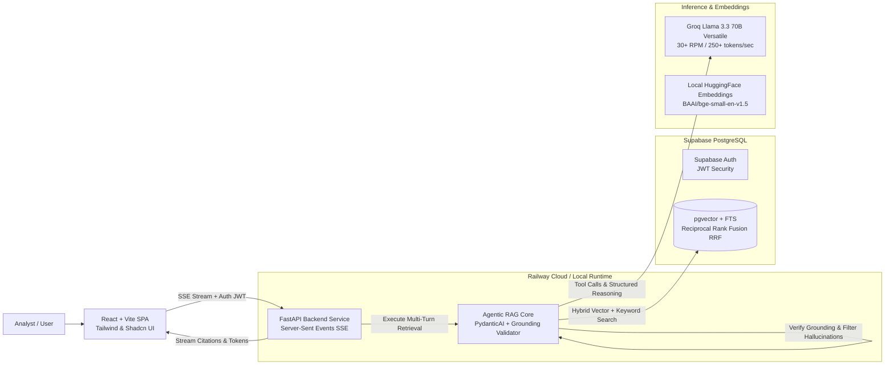

# 📊 Enterprise SEC Financial Filing & Document Copilot (`document-copilot`)

An advanced **Agentic Retrieval-Augmented Generation (RAG) System** designed to ingest, process, and analyze complex SEC financial filings (10-Ks & 10-Qs) in real time. Built for financial analysts, investment researchers, and auditors, Document Copilot allows users to query dense corporate filings in natural language and receive verifiable, high-precision answers with exact verbatim citations and zero hallucination.

---

## 🏛️ System Architecture & Engineering Highlights



### 1. 🤖 Autonomous Agentic Retrieval (FastAPI + PydanticAI)
Unlike standard linear RAG pipelines that execute a single static query against a vector store, Document Copilot implements an **autonomous multi-step reasoning loop** using `PydanticAI`.
* **Dynamic Query Formulation**: When an analyst asks comprehensive questions (e.g., *"Compare Apple's 2023 vs 2024 operating margins and explain the main revenue drivers"*), the agent autonomously calls structured tools (`search_filings`) multiple times across different fiscal years and tickers.
* **Structured JSON Reasoning**: The model returns strongly typed `GroundedAnswer` objects enforcing strict field requirements (`answer`, `citations`, `has_sufficient_evidence`, `confidence_summary`).

### 2. ⚡ Hybrid Retrieval with Reciprocal Rank Fusion (RRF)
Financial filings contain complex nuances: conceptual discussions (*"management's strategy regarding supply chain resilience"*) alongside exact numerical tables (*"Note 14: Leases - $14,290M"*). To capture both:
* **Dense Vector Semantic Search (`pgvector`)**: Ingested document chunks (`chunking.py`) are embedded using local high-precision 384-dimensional embeddings (`BAAI/bge-small-en-v1.5`) via `fastembed`/`sentence-transformers`, enabling deep semantic understanding without third-party API latency or costs.
* **PostgreSQL Full-Text Keyword Search (`tsvector`)**: Utilizes `websearch_to_tsquery` with English stemmers and GIN indexes (`idx_document_chunks_fts`) to guarantee exact keyword matches on specific table numbers, GAAP metrics, and section titles (`10-K Item 7`).
* **Reciprocal Rank Fusion (`fusion.py`)**: Merges and normalizes ranks across both vector and keyword score distributions using the mathematical RRF formula ($Score = \sum \frac{1}{k + rank}$), ensuring optimal passage selection across diverse query types.

### 3. 🛡️ Strict Grounding & Citation Verification Layer (`validator.py`)
In financial analysis, trust is paramount. We implemented a multi-layered verification layer to prevent LLM hallucinations:
* **Pre-Stream Audit**: Our custom `GroundingValidator` intercepts model outputs before finalizing the stream. It verifies that every inline marker (`[1]`, `[2]`) maps 1-to-1 to an authentic retrieved chunk in `SourcePassage`.
* **Verbatim Quote Exactness**: The validator checks whether the exact quote reported (`exact_quote`) actually exists verbatim within the underlying `text_content` from the database.
* **Hallucination Strip & Fallback**: If the model generates unsupported claims or invalid citations, the validator automatically strips unverified quotes and downgrades confidence metrics to ensure 100% factual integrity.
* **Interactive UI Citation Expansion**: The React SPA features interactive citation bubbles (`ReferenceList.tsx`) allowing analysts to click any citation marker and instantly inspect the source document name, section title, fiscal year, and exact highlighted text.

### 4. 🚀 Ultra-Fast Inference via Groq (`Llama 3.3 70B Versatile`)
* Powered by **Groq (`groq:llama-3.3-70b-versatile`)**, delivering world-class 70-billion parameter reasoning at lightning speeds (~250 words per second).
* Bypasses traditional cloud rate limits, providing up to **14,400 daily requests** (`30 requests/minute`) with zero `limit: 0` quota blocks.

---

## 🛠️ Technology Stack

| Layer | Technology | Key Responsibility |
| :--- | :--- | :--- |
| **Backend Framework** | **Python 3.12 + FastAPI** | High-concurrency async API, Server-Sent Events (SSE) streaming (`orchestrator.py`), and Auth JWT verification (`auth.py`). |
| **Agent Core & ORM** | **PydanticAI + SQLAlchemy 2.0** | Strongly typed LLM agent workflows, automated tool calling (`search_filings`), and async database sessions. |
| **Database & Vector Store** | **Supabase PostgreSQL + `pgvector`** | Storing raw filings (`source_documents`), chunked passages (`document_chunks`), 384-dim vector embeddings, and full-text GIN indexes. |
| **Inference Engine** | **Groq API (`Llama 3.3 70B`)** | Real-time streaming generation, structured JSON tool execution, and factual reasoning. |
| **Local Embeddings** | **HuggingFace (`BAAI/bge-small-en-v1.5`)** | Zero-cost local 384-dim vector generation during chunk ingestion and search queries. |
| **Frontend SPA** | **Vite + React 18 + TypeScript** | Responsive modern single-page application (`MessageBubble.tsx`, `Sidebar.tsx`, `Login.tsx`). |
| **Styling & Components** | **Tailwind CSS + Shadcn UI + Lucide** | Premium glassmorphism design, interactive citation drawers, and smooth micro-animations. |
| **Package Management** | **`uv` (Backend) + `pnpm` (Frontend)** | Lightning-fast deterministic dependency management (`pyproject.toml` & `pnpm-lock.yaml`). |
| **Cloud Deployment** | **Railway (`nixpacks.toml`)** | Zero-config production cloud deployment across decoupled backend and frontend containers. |

---

## 📁 Repository Layout

```text
document-copilot/
├── backend/                  # FastAPI & Agentic RAG Service
│   ├── alembic/              # Async PostgreSQL schema migrations
│   ├── app/
│   │   ├── assistant/        # PydanticAI agent definition (`agent.py`) & structured outputs (`outputs.py`)
│   │   ├── chat/             # SSE streaming orchestrator & message persistence (`orchestrator.py`)
│   │   ├── database/         # SQLAlchemy 2.0 models (`document_chunk.py`, `source_document.py`)
│   │   ├── grounding/        # Hallucination filter & citation validator (`validator.py`)
│   │   └── retrieval/        # Hybrid RRF fusion (`fusion.py`), vector (`service.py`) & keyword search (`queries.py`)
│   ├── ingest/               # SEC document parser, semantic chunker, and local embedder (`chunk_and_embed.py`)
│   ├── tests/                # Comprehensive unit test suite (`pytest`) across grounding & retrieval layers
│   ├── nixpacks.toml         # Railway production build instructions for Python 3.12 & `uv`
│   └── pyproject.toml        # Deterministic Python dependencies (`fastapi`, `pydantic-ai`, `groq`, `alembic`)
│
├── frontend/                 # React SPA (Vite + TypeScript)
│   ├── src/
│   │   ├── components/       # UI Components (`chat/MessageBubble.tsx`, `chat/ReferenceList.tsx`, `layout/Sidebar.tsx`)
│   │   ├── hooks/            # SSE chat streaming & auth custom hooks (`useChat.ts`, `useAuth.ts`)
│   │   └── pages/            # Main application views (`ChatPage.tsx`, `Login.tsx`, `DocumentsPage.tsx`)
│   ├── nixpacks.toml         # Railway production build instructions for Node.js 20 & `pnpm`
│   └── package.json          # Frontend scripts (`dev`, `build`, `start`)
│
├── data/                     # Standalone SEC EDGAR Downloader (`download.py`) & sample filing datasets
├── docs/                     # Architectural specs, client briefs, and engineering setup guides
└── README.md                 # This system documentation
```

---

## 📚 Component Documentation & Module Guides

Each subsystem of Document Copilot has its own dedicated documentation detailing setup, scripts, internal design, and architecture:

* 📥 **[Data Acquisition & Ingestion Pipeline (`/data`)](data/README.md)**:
  Contains the SEC EDGAR downloader (`download.py`), instructions on how to download filings for new or recent fiscal quarters, and the deep-learning **Docling (`convert_to_markdown.py`)** HTML-to-Markdown engine that preserves multi-column financial tables and section boundaries.
* 🤖 **[Backend & Agentic RAG Service (`/backend`)](backend/README.md)**:
  Details the FastAPI service, PydanticAI agent definition, Groq (`llama-3.3-70b-versatile`) inference, the `GroundingValidator` verification layer, semantic chunking (`ingestion/`), and Alembic database migrations.
* ⚡ **[Hybrid Retrieval & Reciprocal Rank Fusion (`/backend/app/retrieval`)](backend/app/retrieval/README.md)**:
  In-depth breakdown of dual vector (`pgvector` + local `BAAI/bge-small-en-v1.5` 384-dim embeddings) and keyword (`tsvector` full-text search) retrieval merged via Reciprocal Rank Fusion ($k=60$).
* 💻 **[Frontend SPA (`/frontend`)](frontend/README.md)**:
  Documentation for the Vite + React 18 + TypeScript SPA, detailing real-time Server-Sent Events (SSE) streaming (`useChat.ts`), interactive citation inspection drawers (`ReferenceList.tsx`), and Supabase authentication.
* 🏛️ **[System Architecture & Cloud Deployment (`/docs`)](docs/architecture.md)**:
  Comprehensive system design specifications, data models, and zero-config production deployment instructions for **Railway** (`nixpacks.toml`).

---

## 🚀 Quickstart Summary

1. **Database & Ingestion (`/data` & `/backend`)**:
   * Set your Supabase & Groq API variables in `backend/.env`.
   * Download sample filings: `uv run data/download.py` -> convert to markdown: `uv run data/convert_to_markdown.py`.
   * Run Alembic migrations and ingest chunks: `cd backend && uv run alembic upgrade head && uv run python -m ingest.chunk_and_embed`.
   * Start FastAPI API server: `uv run uvicorn app.main:app --reload --port 8000`.
2. **Frontend UI (`/frontend`)**:
   * Set `VITE_API_BASE_URL=http://localhost:8000/api/v1` and Supabase keys in `frontend/.env`.
   * Install and launch: `pnpm install && pnpm dev` at `http://localhost:5173`.

*For detailed instructions on modifying or running any subsystem, refer directly to the respective directory's `README.md` linked above.*
