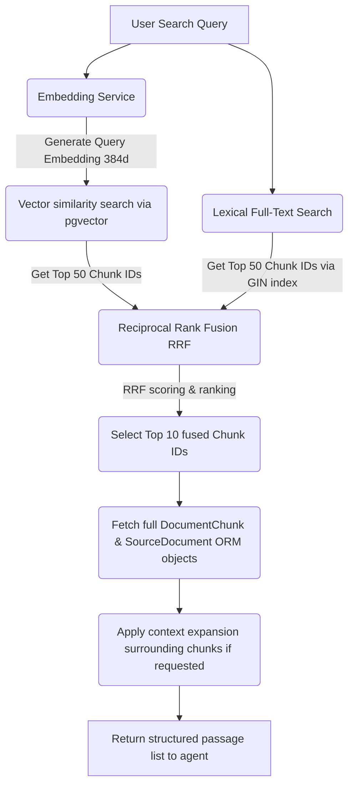

# SEC Filing Hybrid Retrieval Pipeline

This directory contains the retrieval engine for the SEC Filing Copilot. It orchestrates hybrid search by combining dense vector similarity with lexical full-text search, followed by Reciprocal Rank Fusion (RRF) and context expansion.

---

## 🛠 Pipeline Architecture

The retrieval pipeline processes query strings and executes concurrent dense/sparse searches before merging and filtering results:

---

## ⚙️ Core Retrieval Components

### 1. Vector Search (`VectorRetriever`)
* **Logic**: Uses pgvector's `cosine_distance` to search the `document_chunks.embedding` column.
* **Default Candidate Pool (`limit`)**: `50`
* **Default Embedding Model**: `BAAI/bge-small-en-v1.5` (384 dimensions).
* **Index**: HNSW index on the embedding vector column.

### 2. Lexical Search (`LexicalRetriever`)
* **Logic**: Uses PostgreSQL native full-text search with `websearch_to_tsquery` on the `"english"` config, matched against `document_chunks.search_vector`.
* **Keyword Extraction**: Conversational query parsing and keyword extraction is delegated dynamically to the LLM agent via its system instructions (defined in `instructions.py`), ensuring only 3-to-5 clean, high-signal keyword terms are submitted to the search pipeline.
* **Default Candidate Pool (`limit`)**: `50`
* **Ranking**: Sorted by `ts_rank_cd` in descending order.
* **Index**: GIN index on the `search_vector` column.

### 3. Reciprocal Rank Fusion (`reciprocal_rank_fusion`)
* **Logic**: Merges the separate ranked lists of chunk IDs using the RRF algorithm. RRF assigns a score to each item based on its rank in both dense and sparse retrieval:
  $$\text{RRF Score}(d) = \sum_{m \in M} \frac{1}{k + r_m(d)}$$
  where $r_m(d)$ is the rank of document $d$ in rankings list $m$, and $k$ is the smoothing constant.
* **RRF Smoothing Constant (`k`)**: `60`
* **RRF Limit**: Top `10` passages (agent can customize up to `15`).

### 4. Context Expansion (`SurroundingChunkRetriever`)
* **Logic**: Expands the reading window of a retrieved chunk to include preceding and succeeding paragraphs.
* **Default Window Size**: `1` paragraph before and after (agent can customize up to `2`).
* **Returned Range**: `[chunk_index - window, chunk_index + window]`.

---

## 📋 Default Configurations & Thresholds

| Setting | Default Value | Description |
| :--- | :--- | :--- |
| **Embedding Dimension** | `384` | Derived from `BAAI/bge-small-en-v1.5` |
| **Search Limit** | `10` | Number of final fused passages returned to the agent |
| **Max Search Limit** | `15` | Absolute maximum number of passages allowed per search tool call |
| **Candidate limit** | `50` | Number of results retrieved from both vector and lexical queries prior to fusion |
| **RRF Constant ($k$)** | `60` | Smoothing factor for Reciprocal Rank Fusion calculation |
| **FTS Language** | `"english"` | Lexical search configuration token parsing |
| **Context Window** | `1` | Number of surrounding chunks retrieved for extra context (range: 0-2) |

---

## 🗂 File Registry

* [service.py](service.py): The entry point `HybridRetriever` class that runs vector and lexical tasks concurrently.
* [queries.py](queries.py): Individual retriever query builders for Vector, Lexical, and Context Expansion databases.
* [fusion.py](fusion.py): Reciprocal Rank Fusion ranking algorithm implementation.
