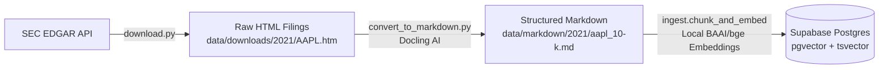

# 📥 SEC Filings & Data Processing Pipeline (`/data`)

This directory contains the standalone data acquisition and document conversion toolchain for **Document Copilot**. It is responsible for downloading authentic SEC filings (10-Ks and 10-Qs) from the public SEC EDGAR database and converting complex HTML financial tables and headings into clean, structured Markdown ready for semantic chunking.

---

## 🏗 Workflow Overview



---

## 🛠 Scripts & Usage

### 1. SEC EDGAR Automated Downloader (`download.py`)
Fetches authentic 10-K/10-Q annual and quarterly financial reports directly from the SEC EDGAR system using custom `User-Agent` headers and strict rate-limiting (<10 requests/sec) to comply with SEC crawling policies.

* **Run Downloader**:
  ```bash
  # Run from project root or inside data/
  uv run data/download.py
  ```
* **Output**: Creates `data/downloads/<fiscal_year>/<ticker>.htm` and writes a `manifest.json` catalog.

> [!TIP]
> **Downloading New or Recent Fiscal Filings**:
> To download filings for newly released fiscal quarters (e.g., 2025 10-Qs or recent 10-Ks) or to add custom companies to your AI corpus, open `download.py`, modify the lists at the top of the file:
> ```python
> TICKERS = ["AAPL", "MSFT", "NVDA", "AMZN", "GOOGL"]
> YEARS = [2023, 2024, 2025]
> FILING_TYPES = ["10-K", "10-Q"]
> ```
> Then run `uv run data/download.py` again. The script will automatically fetch the latest filings and update `manifest.json`.

---

### 2. Deep Learning HTML-to-Markdown Converter (`convert_to_markdown.py`)
SEC EDGAR `.htm` files contain deeply nested tables, inconsistent styling, and multi-column CSS layouts. Standard HTML parsers (`BeautifulSoup` text extraction) destroy financial table structures and lose row/column relationships (`Consolidated Statements of Operations`).

* **Docling Engine**: We use **Docling (`docling.document_converter.DocumentConverter`)**, an advanced AI layout and document parsing engine that identifies tabular boundaries, headers, and reading order.
* **Table & Section Preservation**: Reconstructs complex financial tables into clean GitHub-flavored markdown tables and preserves exact section headers (`Item 1. Business`, `Item 7. Management's Discussion and Analysis`).
* **Run Converter**:
  ```bash
  uv run data/convert_to_markdown.py
  ```
* **Output**: Converted `.md` files are saved recursively in `data/markdown/<year>/<filename>.md` along with `manifest.json`.

---

## 🔄 Next Step: Chunking & Vector Ingestion
Once `data/markdown/` is populated, the backend ingestion module takes over.
Navigate to `/backend` and run the semantic chunker & local embedding pipeline (`chunk_and_embed.py`):
```bash
cd ../backend
uv run python -m ingest.chunk_and_embed
```
*For detailed information on how semantic chunking (~1000 chars), local `BAAI/bge-small-en-v1.5` vector embeddings, and PostgreSQL `tsvector` keyword search indexes are generated, see [backend/README.md](../backend/README.md).*
